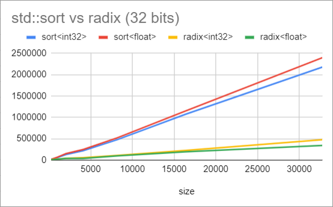
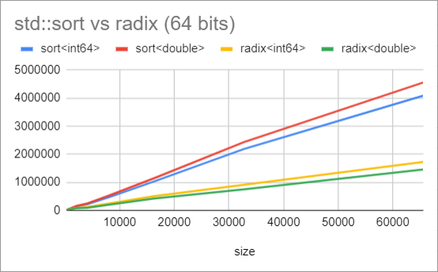

# RadixSort Example

Some time ago a friend asked me about this algorithm because the code I had found on the internet was a bit confusing, so I tried to make it easy to read but with a good performance.

The code uses C++14 although with a few changes it would work in C++11 (mostly remove digit separators).

It can sort signed and unsigned integral values, floats and doubles. The function uses the old school nomenclature:

```cpp
radixSort(buffer, size);
```

The main file compares radix with std::sort for data sizes from 256 to 65536.

## Comparative




## Documentation

You can find useful information about this algorithm here:

- [Radix Sort Revisited](http://codercorner.com/RadixSortRevisited.htm) Pierre Terdiman - January 2000
- [Radix Tricks](http://stereopsis.com/radix.html) Michael Herf - December 2001